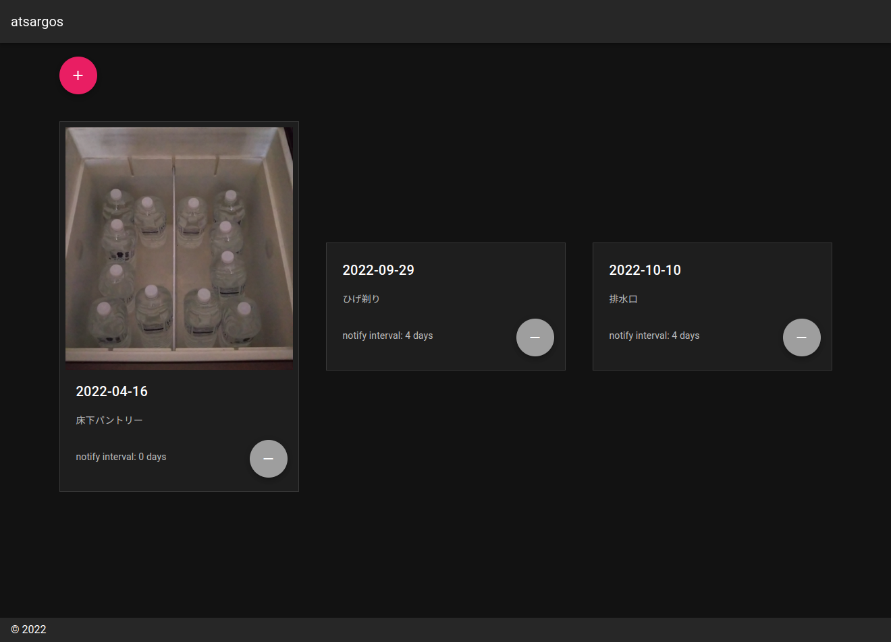
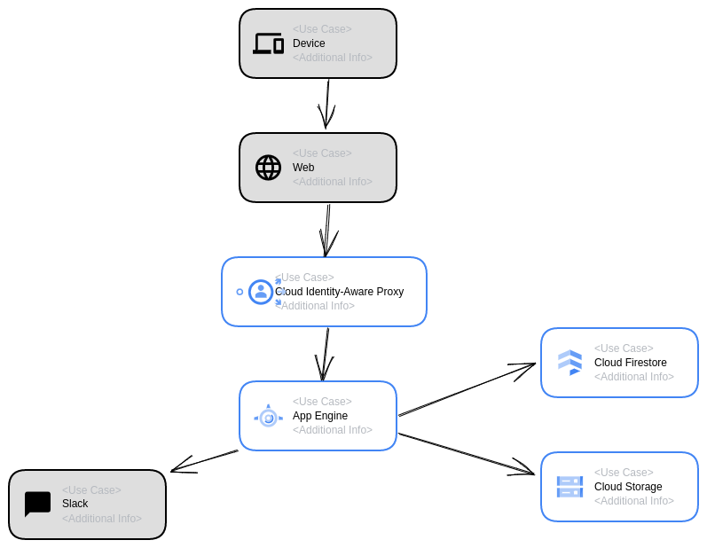

# atsargos（リトアニア語で「在庫」）
在庫や賞味期限のチェッカー

指定日数経過してたらSlackに通知

GCP（App Engine）へデプロイする想定で作成

## 機能

- 管理対象の追加
- 管理対象の編集
- 管理対象の削除
- 画像登録
- Slack通知までの日数指定

## 使用技術

### フロントエンド

Vue.js (Nuxt.js) v2

### バックエンド

Golang v1.15

### インフラ

GCP (App Engine)

https://googlecloudcheatsheet.withgoogle.com/architecture
